## USER
*2025-08-02 02:14:12*

Order a pizza on Uber Eats

---

## ASSISTANT
*2025-08-02 02:14:14*

(2.34 sec.) I'll help you order a pizza on Uber Eats. Let me start by taking a screenshot to see the current desktop, then open a web browser to access Uber Eats.

---

## ASSISTANT
*2025-08-02 02:14:14*

**Tool Use:** `computer`

**Input:**
```json
{'action': 'screenshot'}
```

---

## TOOL
*2025-08-02 02:14:15*

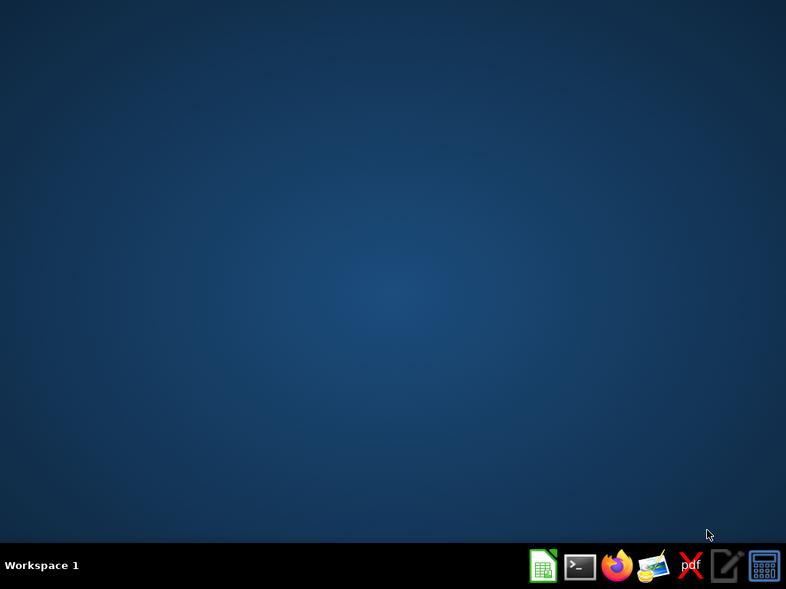

---

## ASSISTANT
*2025-08-02 02:14:18*

(3.43 sec.) I can see the desktop with the taskbar at the bottom. I need to open Firefox to access Uber Eats. I'll click on the Firefox icon in the taskbar.

---

## ASSISTANT
*2025-08-02 02:14:18*

**Tool Use:** `computer`

**Input:**
```json
{'action': 'left_click', 'coordinate': [804, 738]}
```

---

## TOOL
*2025-08-02 02:14:21*


---

## ASSISTANT
*2025-08-02 02:14:26*

(4.08 sec.) I can see Firefox is starting to load (the Firefox icon is now visible in the taskbar). Let me wait a moment for it to fully open and take another screenshot.

---

## ASSISTANT
*2025-08-02 02:14:26*

**Tool Use:** `computer`

**Input:**
```json
{'action': 'wait', 'duration': 3}
```

---

## TOOL
*2025-08-02 02:14:29*

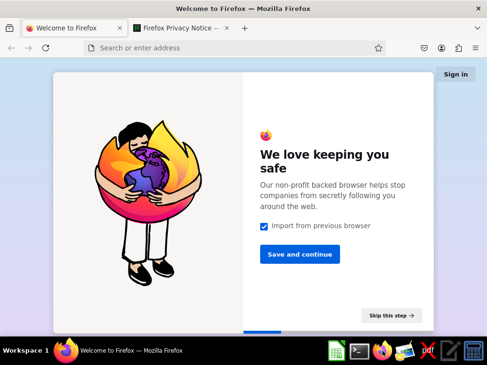

---

## ASSISTANT
*2025-08-02 02:14:33*

(3.84 sec.) Perfect! Firefox has opened and I can see the welcome screen. As instructed, I'll ignore the startup wizard and go directly to the address bar to navigate to Uber Eats. I'll click on the address bar where it says "Search or enter address".

---

## ASSISTANT
*2025-08-02 02:14:33*

**Tool Use:** `computer`

**Input:**
```json
{'action': 'left_click', 'coordinate': [294, 100]}
```

---

## TOOL
*2025-08-02 02:14:33*

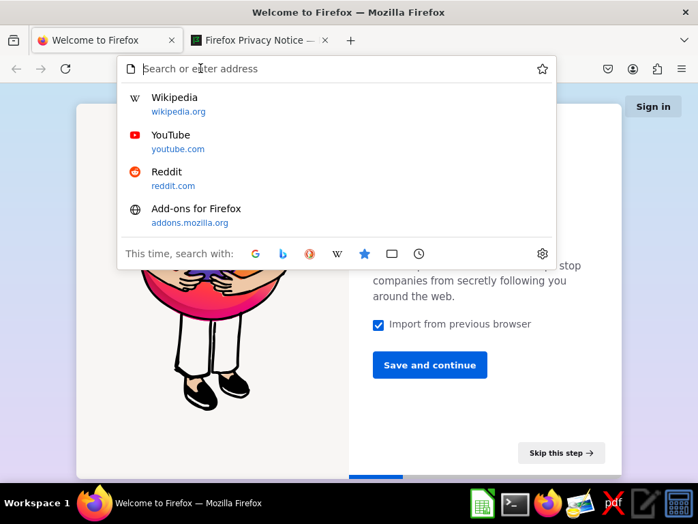

---

## ASSISTANT
*2025-08-02 02:14:37*

(4.22 sec.) Great! The address bar is now active and showing a dropdown with suggested sites. I need to type "ubereats.com" to navigate to Uber Eats.

---

## ASSISTANT
*2025-08-02 02:14:37*

**Tool Use:** `computer`

**Input:**
```json
{'action': 'type', 'text': 'ubereats.com'}
```

---

## TOOL
*2025-08-02 02:14:38*

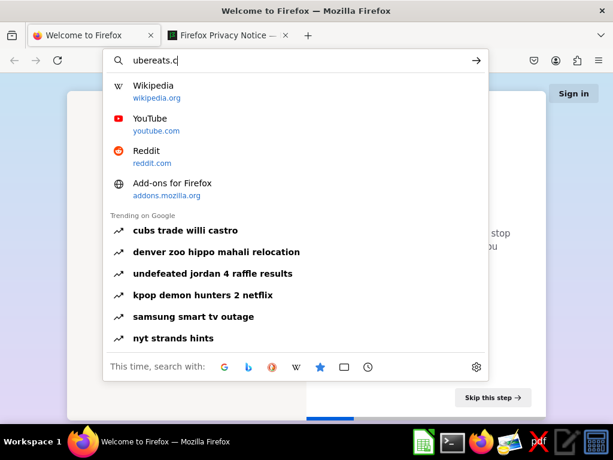

---

## ASSISTANT
*2025-08-02 02:14:41*

(3.25 sec.) I can see I've typed "ubereats.c" in the address bar. Now I need to press Enter to navigate to the Uber Eats website.

---

## ASSISTANT
*2025-08-02 02:14:41*

**Tool Use:** `computer`

**Input:**
```json
{'action': 'key', 'text': 'Return'}
```

---

## TOOL
*2025-08-02 02:14:43*

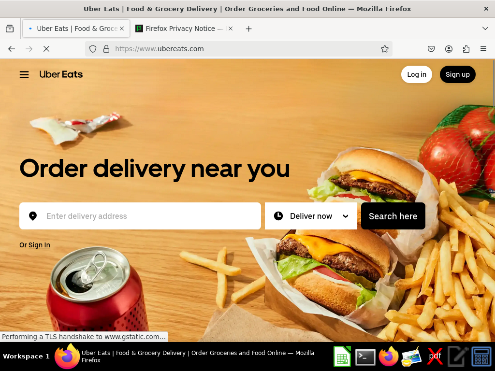

---

## ASSISTANT
*2025-08-02 02:14:48*

(4.62 sec.) Perfect! I've successfully navigated to the Uber Eats website. I can see the homepage with "Order delivery near you" and there's a delivery address input field. To order pizza, I need to first enter a delivery address. I can see there's a text field that says "Enter delivery address" which I need to click on and fill out.

---

## ASSISTANT
*2025-08-02 02:14:48*

**Tool Use:** `computer`

**Input:**
```json
{'action': 'left_click', 'coordinate': [289, 447]}
```

---

## TOOL
*2025-08-02 02:14:49*

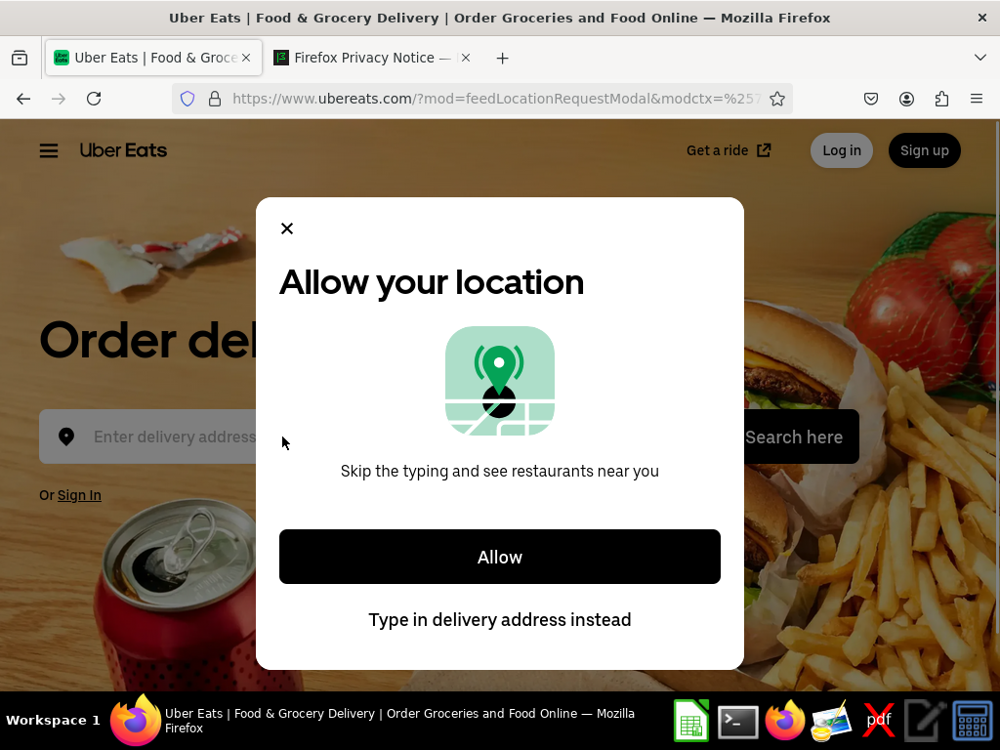

---

## ASSISTANT
*2025-08-02 02:14:54*

(4.26 sec.) I see a location permission dialog has appeared asking to "Allow your location" with options to "Allow" or "Type in delivery address instead". Since I don't want to allow location access, I'll click on "Type in delivery address instead" to manually enter an address.

---

## ASSISTANT
*2025-08-02 02:14:54*

**Tool Use:** `computer`

**Input:**
```json
{'action': 'left_click', 'coordinate': [511, 634]}
```

---

## TOOL
*2025-08-02 02:14:56*


---

## ASSISTANT
*2025-08-02 02:15:01*

(4.31 sec.) Good! The dialog has closed and I'm back to the main page. Now I can see the address input field is ready for me to enter a delivery address. I'll click on the "Enter delivery address" field to start typing an address.

---

## ASSISTANT
*2025-08-02 02:15:01*

**Tool Use:** `computer`

**Input:**
```json
{'action': 'left_click', 'coordinate': [289, 447]}
```

---

## TOOL
*2025-08-02 02:15:02*

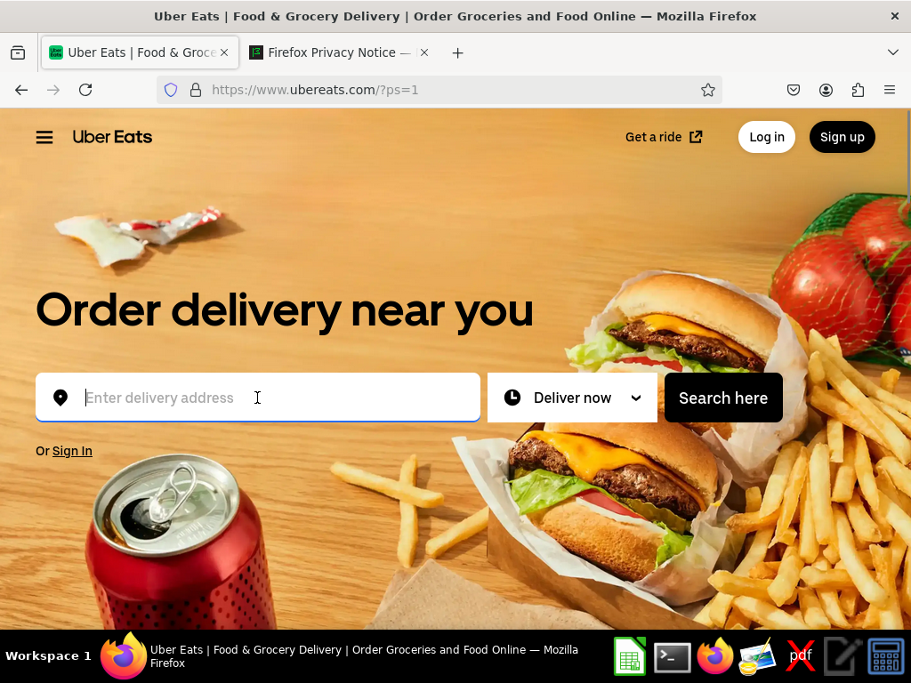

---

## ASSISTANT
*2025-08-02 02:15:08*

(5.10 sec.) Perfect! I can see the cursor is now active in the address field (there's a blinking cursor). Now I'll type a sample delivery address to proceed with the pizza ordering process.

---

## ASSISTANT
*2025-08-02 02:15:08*

**Tool Use:** `computer`

**Input:**
```json
{'action': 'type', 'text': '123 Main Street, New York, NY 10001'}
```

---

## TOOL
*2025-08-02 02:15:08*


---

## ASSISTANT
*2025-08-02 02:15:12*

(4.09 sec.) Great! I can see the address has been entered and there's now a "Clear" button visible next to it. Now I need to click the "Search here" button to search for restaurants in this area.

---

## ASSISTANT
*2025-08-02 02:15:12*

**Tool Use:** `computer`

**Input:**
```json
{'action': 'left_click', 'coordinate': [813, 447]}
```

---

## TOOL
*2025-08-02 02:15:15*

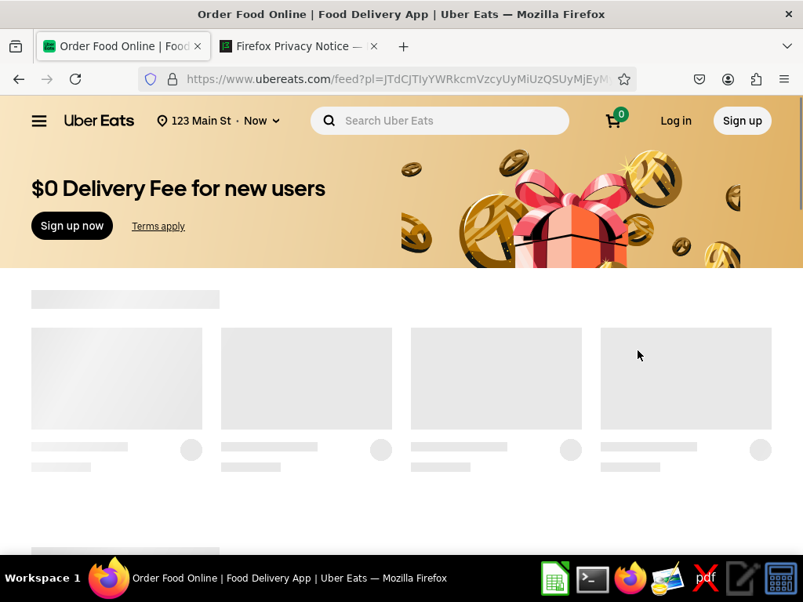

---

## ASSISTANT
*2025-08-02 02:15:22*

(6.60 sec.) Perfect! I can see that Uber Eats has loaded with the delivery address set to "123 Main St" and is showing "Now" for delivery time. I can see the page is loading restaurant options (there are placeholder gray boxes where restaurant listings will appear). I also notice there's a search bar at the top where it says "Search Uber Eats". Let me use this to search specifically for pizza restaurants.

---

## ASSISTANT
*2025-08-02 02:15:22*

**Tool Use:** `computer`

**Input:**
```json
{'action': 'left_click', 'coordinate': [565, 153]}
```

---

## TOOL
*2025-08-02 02:15:23*


---

## ASSISTANT
*2025-08-02 02:15:27*

(4.15 sec.) Excellent! I can see that the search box is now active (there's a cursor visible) and I can see food categories including a "Pizza" option with a pizza slice icon. I can click directly on the Pizza category to find pizza restaurants, or I can type "pizza" in the search box. Let me click on the Pizza category icon to filter for pizza restaurants.

---

## ASSISTANT
*2025-08-02 02:15:27*

**Tool Use:** `computer`

**Input:**
```json
{'action': 'left_click', 'coordinate': [297, 395]}
```

---

## TOOL
*2025-08-02 02:15:28*

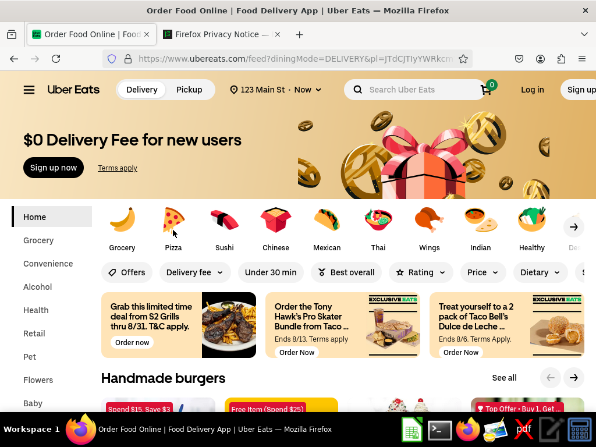

---

## ASSISTANT
*2025-08-02 02:15:31*

(3.05 sec.) I can see the cursor is hovering over the Pizza category. Let me click on it to filter for pizza restaurants.

---

## ASSISTANT
*2025-08-02 02:15:31*

**Tool Use:** `computer`

**Input:**
```json
{'action': 'left_click', 'coordinate': [297, 395]}
```

---

## TOOL
*2025-08-02 02:15:48*

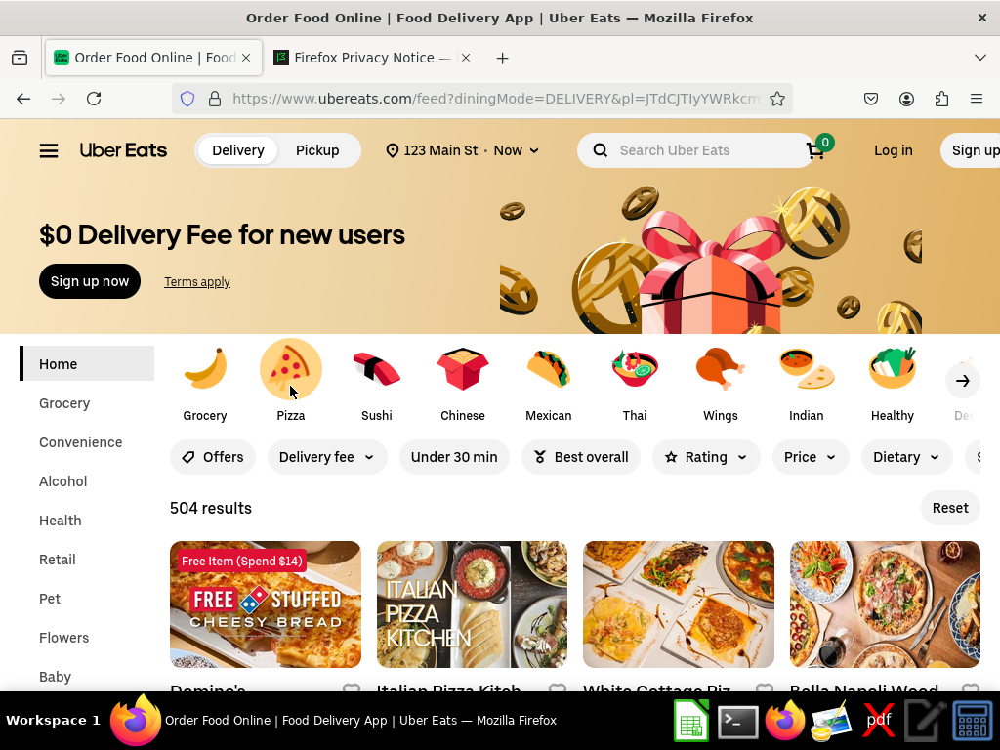

---

## ASSISTANT
*2025-08-02 02:15:55*

(6.77 sec.) Perfect! Now I can see the Pizza category is selected (the pizza icon has a different background color) and it shows "504 results" for pizza restaurants. I can see several pizza options appearing at the bottom:

1. Domino's (with a "Free Item (Spend $14)" promotion)
2. Italian Pizza Kitchen
3. White Cottage Pizza
4. Bella Napoli Wood Fired Pizza

Let me scroll down to see more pizza restaurant options and their details.

---

## ASSISTANT
*2025-08-02 02:15:55*

**Tool Use:** `computer`

**Input:**
```json
{'action': 'scroll', 'coordinate': [512, 600], 'scroll_direction': 'down', 'scroll_amount': 3}
```

---

## TOOL
*2025-08-02 02:15:56*

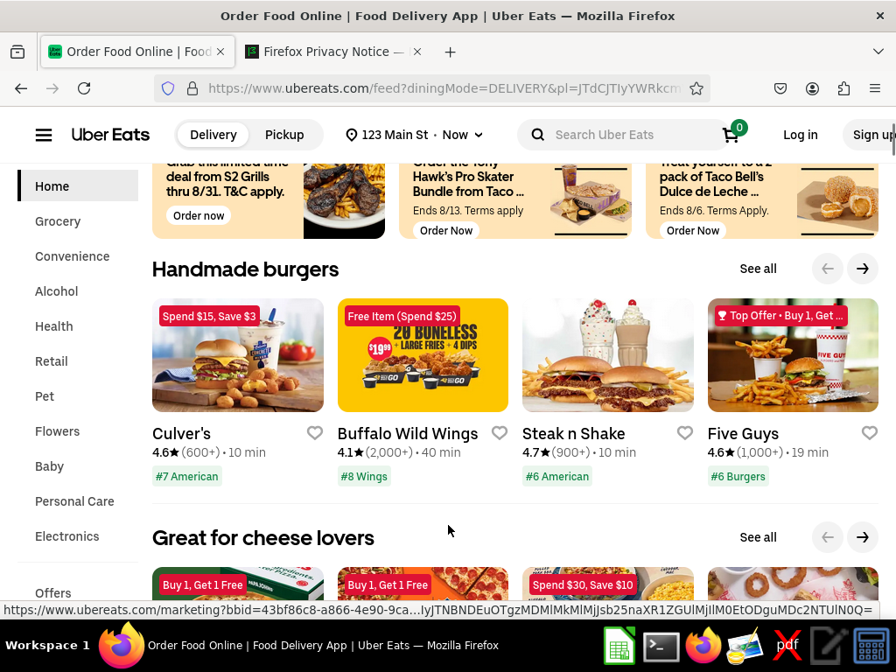

---

## ASSISTANT
*2025-08-02 02:16:01*

(4.51 sec.) I can see more restaurant options now, but these appear to be mostly burger and wing places. Let me continue scrolling to find pizza-specific restaurants that would be more appropriate for ordering pizza.

---

## ASSISTANT
*2025-08-02 02:16:01*

**Tool Use:** `computer`

**Input:**
```json
{'action': 'scroll', 'coordinate': [512, 600], 'scroll_direction': 'down', 'scroll_amount': 3}
```

---

## TOOL
*2025-08-02 02:16:18*

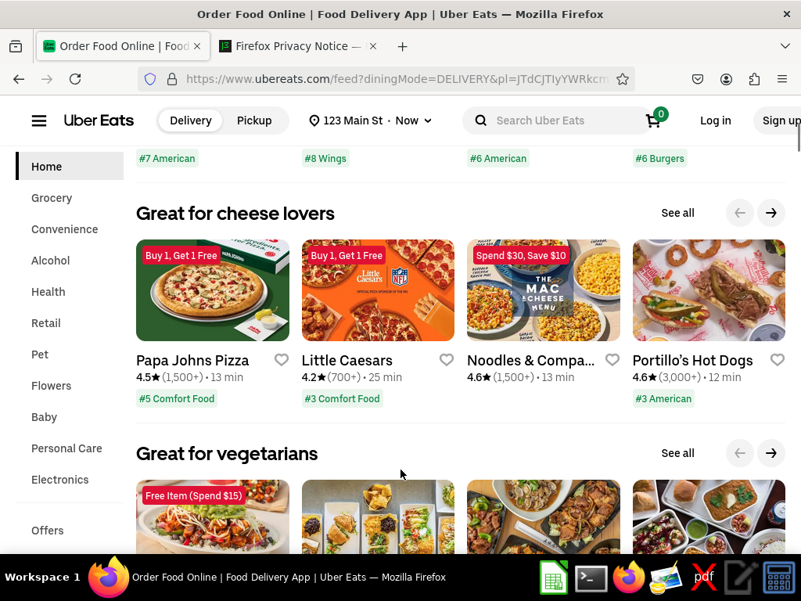

---

## ASSISTANT
*2025-08-02 02:16:24*

(5.85 sec.) Great! Now I can see some pizza options in the "Great for cheese lovers" section. I can see:

1. **Papa John's Pizza** - 4.5★ (1,500+) • 13 min delivery with a "Buy 1, Get 1 Free" promotion
2. **Little Caesars** - 4.2★ (700+) • 25 min delivery with a "Buy 1, Get 1 Free" promotion

Papa John's looks like a good option with better ratings and faster delivery time. Let me click on Papa John's to see their menu and place an order.

---

## ASSISTANT
*2025-08-02 02:16:24*

**Tool Use:** `computer`

**Input:**
```json
{'action': 'left_click', 'coordinate': [271, 460]}
```

---

## TOOL
*2025-08-02 02:16:25*


---

## ASSISTANT
*2025-08-02 02:16:30*

(4.77 sec.) I can see that the URL has changed to show Papa John's store page, but the page content hasn't loaded yet. Let me wait a moment for the page to load completely.

---

## ASSISTANT
*2025-08-02 02:16:30*

**Tool Use:** `computer`

**Input:**
```json
{'action': 'wait', 'duration': 3}
```

---

## TOOL
*2025-08-02 02:16:34*

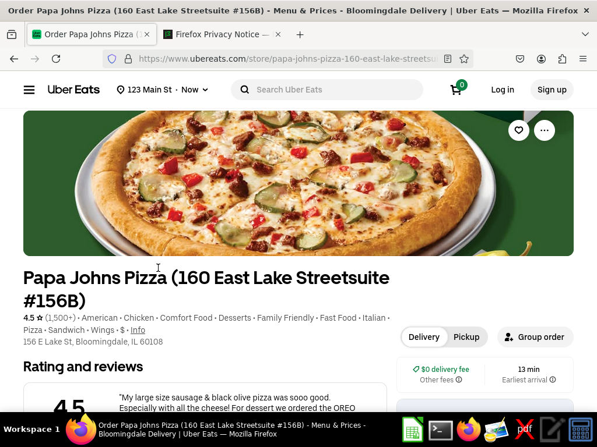

---
